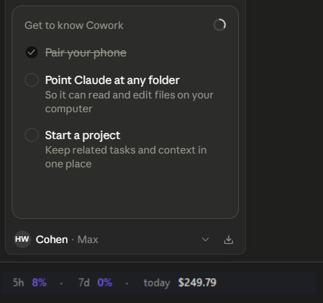
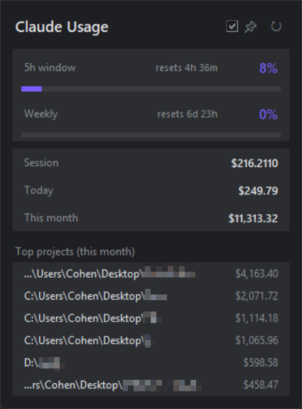

# ClaudeUsageMonitor

A lightweight Windows desktop monitor for **Claude Code Pro / Max** subscribers:
real-time 5-hour & weekly quota, per-project equivalent-API cost, and a tiny
always-visible taskbar strip — without ever asking you to log in separately.




## Why this exists

Off-the-shelf options each had a deal-breaker:

| Tool | Auth | UI | Showstopper |
|---|---|---|---|
| [CodeZeno/Claude-Code-Usage-Monitor](https://github.com/CodeZeno/Claude-Code-Usage-Monitor) | Piggybacks Claude Code OAuth ✅ | Pixelated colored blocks ❌ | Ugly UI |
| [SlavomirDurej/claude-usage-widget](https://github.com/SlavomirDurej/claude-usage-widget) | Claude.ai web session ❌ | Beautiful Electron ✅ | Requires periodic browser re-login |
| [ryoppippi/ccusage](https://github.com/ryoppippi/ccusage) | Local JSONL only | CLI / statusline | No GUI / no real quota |

This project takes the best of all three: **OAuth-piggyback auth** (zero
re-login) + **clean tkinter UI** + **per-project cost** from local JSONL.

## What it shows

- **5-hour rolling quota** — real % from Anthropic's server (not estimated)
- **Weekly quota** — same source, color-coded at 75% / 90% / 95%
- **Per-project cost** — equivalent API $ from `~/.claude/projects/**/*.jsonl`
- **Session / today / this-month** rollups
- **Threshold toasts** — Windows native notifications when crossing 75/90/95%

Two UIs, both optional:
- **Taskbar strip**: borderless 360×26 px strip pinned just above the Windows
  taskbar. Drag-to-reposition mode in tray menu — drag anywhere, position
  persists across restarts.
- **Floating window**: full-detail dark card. Hidden by default; click tray or
  strip to open.

## How the auth works

The interesting (and undocumented) bit: Anthropic exposes
`https://api.anthropic.com/api/oauth/usage` which returns the same authoritative
5h / weekly utilization numbers Claude Code itself uses. We piggyback on
Claude Code's local OAuth token at `~/.claude/.credentials.json` (no separate
login required) and call this endpoint with:

```
Authorization: Bearer <accessToken from credentials>
anthropic-beta: oauth-2025-04-20
User-Agent: claude-code/2.0.0     # required — without this you hit a tight rate-limit bucket
```

Response:
```json
{
  "five_hour": {"utilization": 33.0, "resets_at": "2026-05-26T00:50:00+00:00"},
  "seven_day": {"utilization": 91.0, "resets_at": "2026-05-26T00:59:59+00:00"},
  ...
}
```

The endpoint is rate-limited at ~5 req/token, so we poll every 6 minutes.

## Architecture

```
usage_api.py     OAuth token loader + /api/oauth/usage HTTP client
jsonl_costs.py   JSONL parser + cost aggregator (pricing table inline)
state.py         Two daemon threads: API poll (6 min) and JSONL parse (30s).
                 Threshold-cross alerts fire once per crossing per window.
app.py           Entry: tkinter FloatingWindow + pystray tray icon + TaskbarStrip.
                 Strip uses the "bump trick" (-topmost False→True + lift())
                 to stay reliably on top across Win11 shell UI interactions.
```

## Install

Requires Windows 10/11, Python 3.11+, and Claude Code (logged in).

```powershell
git clone https://github.com/Cohenjikan/ClaudeUsageMoniter D:\Apps\cc-usage-tray
cd D:\Apps\cc-usage-tray
pip install pystray Pillow winotify
pythonw.exe app.py
```

For autostart, create a Startup-folder shortcut to:
```
"<python_install>\pythonw.exe" "D:\Apps\cc-usage-tray\app.py"
```
with working directory `D:\Apps\cc-usage-tray`. `pythonw.exe` (not `python.exe`)
avoids a console window.

## Configuration

Most behavior is constants at the top of `app.py`:

```python
WINDOW_W, WINDOW_H = 340, 460     # floating window size
STRIP_W, STRIP_H = 360, 26        # taskbar strip size
STRIP_SIDE = "left"               # "left" or "right" — which screen edge
STRIP_SIDE_MARGIN = 12            # gap from chosen edge
STRIP_GAP_FROM_TASKBAR = 0        # gap between strip bottom and taskbar top
```

Per-user strip position (set by dragging) lives in `config.json` next to the
script. Delete it or use the tray menu's "Reset strip position" to snap back.

Pricing table in `jsonl_costs.py:PRICING` — update when Anthropic adjusts
rates or releases new model families.

## Caveats

- **Rate limit**: `/api/oauth/usage` is aggressive (~5 req/token). We poll
  every 6 min, well within budget.
- **OAuth refresh**: tokens expire every 8h. The app auto-refreshes via
  Anthropic's `/v1/oauth/token` endpoint and atomically writes the new
  tokens back to `~/.claude/.credentials.json` — you never have to manually
  `/login` under normal operation. Refresh attempts are rate-limited to one
  per 5 min; on `invalid_grant` we back off for an hour and surface a
  "run /login in Claude Code" message in the strip footer (very rare).
- **Local cost is API-equivalent**, not what you actually pay (you pay flat
  Pro/Max subscription). Useful for comparing project value, not billing.
- **Cache pricing**: `cache_creation_input_tokens` has two tiers (5-minute
  and 1-hour ephemeral) — both are tracked and priced separately.
- **Multi-monitor**: strip always pins to the primary monitor. Drag-mode
  positions can land on a secondary monitor; reset returns to primary.
- **Fullscreen-exclusive games**: nothing in user space can render above true
  exclusive-fullscreen apps. Use borderless windowed mode if you want the
  strip visible while gaming.

## License

MIT — see [LICENSE](LICENSE).
