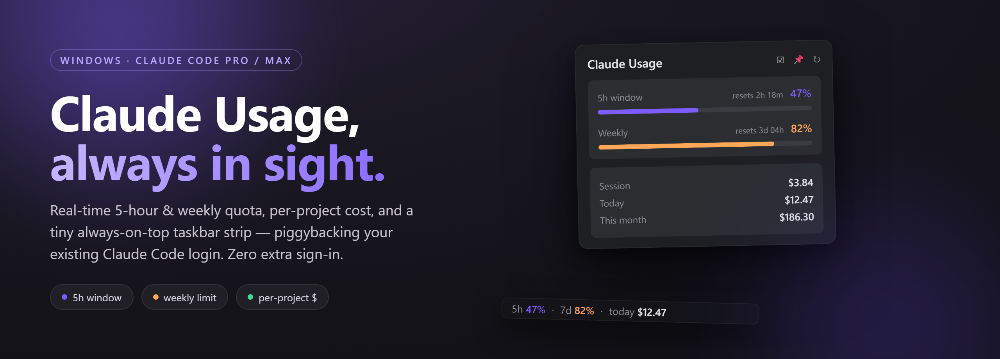
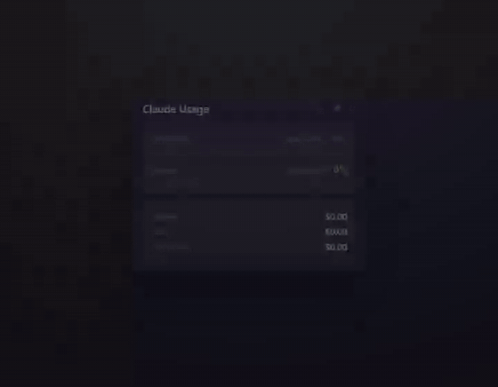
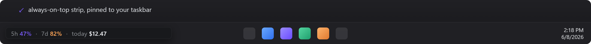
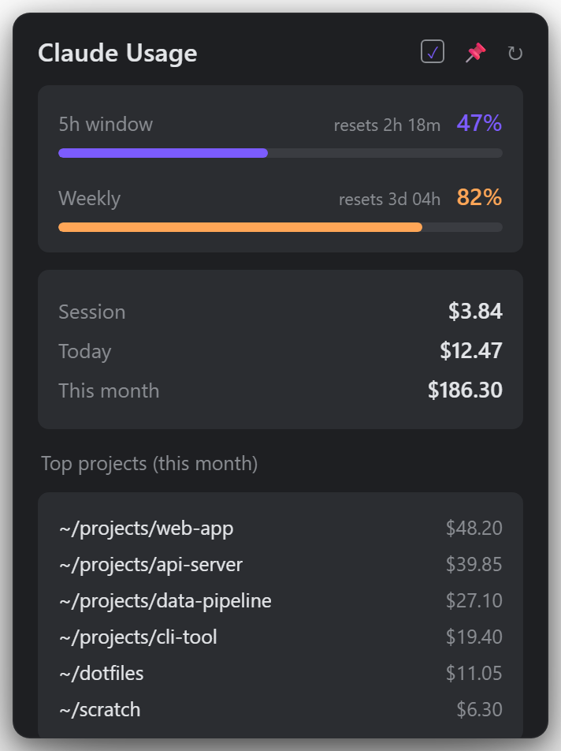
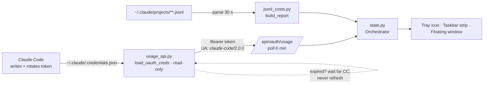

<div align="center">

# ClaudeUsageMonitor

### A featherweight Windows tray app that shows your real Claude Code Pro/Max quota live — piggybacking Claude Code's own login so you never log in twice.

**English** · **[中文](README.zh.md)**

[](LICENSE)
[](#requirements)
[](https://www.python.org/)
[](https://github.com/Cohenjikan/ClaudeUsageMoniter/stargazers)

**Your Claude quota, always on the taskbar. Zero extra logins.**



</div>

---

<div align="center">



*Live demo. [Watch the full promo →](screenshots/promo.mp4)*

</div>

---

## Why you'll want this

You live in Claude Code all day. You keep hitting the 5-hour wall or the weekly cap and finding out *only when Claude tells you*. Existing monitors either look like a broken spreadsheet, make you re-login through a browser every few hours, or only count your local logs and never show the real server quota.

**ClaudeUsageMonitor pins the authoritative numbers to your taskbar and stays out of your way.** It reads the same OAuth token Claude Code already wrote to disk, calls Anthropic's own usage endpoint, and shows you exactly how close you are to the limit — before you slam into it.

> **The trick:** it *reads* Claude Code's local OAuth token at `~/.claude/.credentials.json` — and never writes it. There is **no login screen anywhere in this app** — install it and it just works.

---

## What you get

Benefit first, mechanism second. Everything below is wired to real code in this repo.

### Zero separate login (OAuth piggyback)
Install and it just works, using the Claude Code session you already have. Nothing to sign into, ever.
> `usage_api.py` reads `~/.claude/.credentials.json` and re-reads it from disk on **every** call (`load_oauth_creds`, lines 89–112), so it automatically picks up tokens that Claude Code itself rotates. There is no login UI anywhere in the codebase.

### Real server-side quota, not an estimate
The 5-hour and weekly percentages are the *same authoritative numbers Claude Code uses*, and they include **all** of your subscription usage — Code **plus** chat/desktop/web — not a guess from local logs.
> `fetch_usage` (`usage_api.py:189`) GETs `https://api.anthropic.com/api/oauth/usage` and reads `five_hour.utilization` / `seven_day.utilization` straight from the response. The endpoint is undocumented; the `User-Agent` must be `claude-code/2.0.0` or it lands in a tighter rate-limit bucket.

### Read-only auth — it can never break your Claude Code login
This monitor **never refreshes or writes** the OAuth token. The `refresh_token` in `~/.claude/.credentials.json` is shared with Claude Code and *rotates on every use*, so any process that refreshes it invalidates the other's copy — refreshing here once broke the user's Claude Code login. So we don't. We read whatever access token Claude Code currently maintains; when it expires, we **wait for Claude Code to rotate it** (which it does on its own next use) and pick up the fresh token automatically — meanwhile the quota is clearly marked **stale** rather than shown as live.
> `_do_fetch_cycle` (`state.py`) only ever calls `load_oauth_creds` (a disk read) + `fetch_usage` (a GET). On an expired/401 token it sets `token_expired` and re-checks the disk every `TOKEN_RECHECK_SEC` (45 s, no network) so it recovers within seconds of your next Claude Code use. Nothing in the app writes `credentials.json`.

### Always-visible taskbar strip
A tiny borderless readout sits right on the Windows taskbar, so your quota is glanceable without opening anything.



> `TaskbarStrip` (`app.py:515+`) is a borderless `overrideredirect` `Toplevel` with a nominal `STRIP_W, STRIP_H = 360, 26`, pinned inside the taskbar band via `get_strip_default_y`. Its width auto-grows to fit the rendered text each tick — it is not a fixed-width bar.

### Stays on top of the Win11 shell
The strip doesn't get buried by maximized windows, the taskbar, or autostart races at boot.
> Three defenses in `app.py`: a per-tick topmost bump (`_force_topmost`), a direct `SetWindowPos(HWND_TOPMOST)` backup (`_force_topmost_winapi`), and `WindowFromPoint` multi-point coverage detection (`_is_covered`) — plus a startup bump burst from 300 ms to 10 s.

### Drag-to-place, position persists
Put the strip wherever you like; it stays there across restarts.
> Move-strip drag mode saves x/y to a per-user `config.json` next to the script on mouse release (`_on_btn1_release`); on the next launch the strip restores that saved position. `reset_position` snaps it back to defaults.

### Per-project / today / month / session cost
See which projects burn the most equivalent-API dollars, plus running today/month totals — handy for comparing project value.
> `jsonl_costs.py` parses `~/.claude/projects/**/*.jsonl` (`iter_turns`) and aggregates into `by_project`, `by_session`, `today`, `this_month` (`build_report`). Day/month boundaries use your **local** timezone.
> **De-duplication (important for accuracy):** Claude Code writes a separate JSONL line for every content block of an assistant message (thinking, text, and each `tool_use`), and they all carry the **same** `message.id`, `requestId`, and `usage` object. Counting every line over-counts cost massively — on real data ~62% of usage lines are such duplicates, inflating totals ~4–5×. `iter_turns` counts each `(message.id, requestId)` exactly once (same approach as `ccusage`). The de-dup set is global across files, which also collapses history duplicated into resumed/forked sessions.

### Two-tier cache pricing
Cost estimates respect Anthropic's split cache-creation pricing, so the equivalent-$ figure is closer to reality.
> `PRICING` (`jsonl_costs.py:21`) holds separate `cache_5m` and `cache_1h` rates per model; `_parse_turn` reads `ephemeral_5m_input_tokens` and `ephemeral_1h_input_tokens` and prices them independently.

### Native threshold toasts at 75 / 90 / 95%
Windows pops a notification before you hit the wall, with escalating wording as you approach the limit.
> `Orchestrator.THRESHOLDS = (75, 90, 95)` (`state.py:76`); `_check_thresholds` fires once per crossing and re-arms when usage drops below; `notify()` sends a `winotify` toast whose body escalates at 90% and 95%.

### Full-detail floating window
Click the strip or tray for a dark card with quota bars, reset countdowns, cost rollups, and a top-projects list.



> `FloatingWindow` renders color-coded 5h/7d bars (with per-model Opus/Sonnet sub-bars when present), absolute reset times with live countdowns (repaints every 1 s), session/today/month costs, and up to 6 top-project rows. The projects panel is **scoped to the current month** (`by_project_month`). Hidden by default.

### Tray icon shows live 5h%
Even with no windows open, the system-tray badge tells you your 5-hour usage at a glance, color-coded by severity.
> `render_tray_icon` (`app.py:282`) draws the integer 5h% on a rounded rect colored by `color_for_pct` (green / orange / red), updated on every state change.

### Bilingual UI and a real Settings window
Switch between English and Chinese, toggle autostart, and choose strip side / opacity / display mode — all from one **tray → Settings** window (General / Strip / About), not buried tray submenus.
> `LANGUAGES` holds `en` and `zh` dicts driving every visible string; `SettingsWindow` (`app.py`) is a dark-themed `Toplevel` with a custom segmented tab bar. It offers the language picker, the **Run at startup** checkbox, strip side (left/right), opaque background, and four display modes (compact / +time-remaining / +time-remaining% / +time-elapsed%). Live changes apply immediately and persist to `config.json`.

### Boots instantly, never silently freezes
The window shows your last-known quota the moment it opens — even before the first network call — and only one copy ever runs. If the data pipeline ever stalls (expired token, dead network), the quota is greyed and marked **stale** with its age, so it reads as *old data*, never as a frozen app.
> A single-instance named mutex makes a second launch exit quietly (`main()`). The last good snapshot is cached to `usage_cache.json` and seeded on startup, with a fast-retry ladder so fresh numbers land quickly once connectivity clears. Both repaint loops reschedule in `finally` (an exception can't kill the chain), every Settings PowerShell call runs off the main thread, and a rotating file log (`cc-usage-tray.log`) captures diagnostics that `pythonw.exe` would otherwise discard.

---

## Quickstart

**Prerequisites:** Windows 10/11 · Python 3.11+ · Claude Code **already logged in** (so `~/.claude/.credentials.json` exists).

```powershell
# 1. Clone
git clone https://github.com/Cohenjikan/ClaudeUsageMoniter D:\Apps\cc-usage-tray
cd D:\Apps\cc-usage-tray

# 2. Install dependencies (tkinter ships with Python)
pip install pystray Pillow winotify

# 3. Run — use pythonw (no console window)
pythonw.exe app.py
```

That's it. A tray icon appears with your live 5h%, and the strip pins to your taskbar. **No login prompt — it rides the Claude Code session you already have.**

### Optional: launch at startup

Easiest way: open **tray → Settings → General** and tick **Run at startup**. It creates (and removes) the Startup-folder shortcut for you, using `pythonw.exe` so no console window flashes on boot. If an autostart launcher for this app already exists, the checkbox detects it and reflects its state.

Manual alternative — create a shortcut in your Startup folder (`Win+R` → `shell:startup`) pointing to:

```
Target:    "<python_install>\pythonw.exe" "D:\Apps\cc-usage-tray\app.py"
Start in:  D:\Apps\cc-usage-tray
```

Use `pythonw.exe` (not `python.exe`) to avoid a console window flashing on boot.

---

## How the auth works

The interesting (and undocumented) bit: Anthropic exposes `https://api.anthropic.com/api/oauth/usage`, which returns the same authoritative 5h / weekly utilization Claude Code itself uses. We piggyback on Claude Code's local OAuth token at `~/.claude/.credentials.json` (no separate login) and call the endpoint with:

```http
Authorization: Bearer <accessToken from credentials>
anthropic-beta: oauth-2025-04-20
User-Agent: claude-code/2.0.0     # required — without this you hit a tight rate-limit bucket
```

Response (shape — values illustrative):

```json
{
  "five_hour": {"utilization": 33.0, "resets_at": "2026-05-26T00:50:00+00:00"},
  "seven_day": {"utilization": 91.0, "resets_at": "2026-05-26T00:59:59+00:00"}
}
```

The endpoint is rate-limited at ~5 requests/token, so we poll it every **6 minutes**. The local JSONL cost view refreshes faster, every **30 seconds**.


```mermaid
flowchart LR
    A[Claude Code<br/>writes + rotates token] -->|~/.claude/.credentials.json| B[usage_api.py<br/>load_oauth_creds · read-only]
    B -->|Bearer token<br/>UA: claude-code/2.0.0| C[/api/oauth/usage<br/>poll 6 min/]
    B -.->|expired? wait for CC,<br/>never refresh| B
    C --> D[state.py<br/>Orchestrator]
    E[~/.claude/projects/**.jsonl] -->|parse 30 s| F[jsonl_costs.py<br/>build_report]
    F --> D
    D --> G[Tray icon · Taskbar strip · Floating window]
```

---

## Why this exists

Off-the-shelf options each had a deal-breaker. (The auth/UI mechanism of *this* project is verified from the code here; the assessments of the other tools are the author's own.)

| Tool | Auth | UI | Showstopper (author's take) |
|---|---|---|---|
| [CodeZeno/Claude-Code-Usage-Monitor](https://github.com/CodeZeno/Claude-Code-Usage-Monitor) | Piggybacks Claude Code OAuth | Pixelated colored blocks | Ugly UI |
| [SlavomirDurej/claude-usage-widget](https://github.com/SlavomirDurej/claude-usage-widget) | Claude.ai web session | Electron widget | Periodic browser re-login |
| [ryoppippi/ccusage](https://github.com/ryoppippi/ccusage) | Local JSONL only | CLI / statusline | No GUI · no real server quota |
| **ClaudeUsageMonitor** | **OAuth piggyback** | **Tray + strip + window** | **Windows-only** |

This project takes what it wanted from all three: **OAuth-piggyback auth** (zero re-login) + a **clean tkinter UI** + **real server-side quota %** + **per-project cost** from local JSONL. It pins inside the Win11 taskbar band with a 3-mechanism topmost defense, so maximized windows structurally can't cover it — a problem most floating widgets ignore.

---

## Honest caveats (trust is a feature)

Read these before you rely on the numbers. They are deliberate, not bugs.

- **The `$` figures are Claude Code (CLI) only.** Today / session / month / per-project dollars come **purely** from local `~/.claude/projects` transcripts. The Claude **desktop app and web chat write no local token counts**, so on a chat-only day **"Today $" stays $0.00**. The 5h/7d **percent** bars are different — those come from the server and **do** include chat + code together. That's the number to watch if you mix the two.
- **Equivalent-API $ is for comparison, not billing.** You pay a flat Pro/Max subscription. These dollars estimate what the same tokens would cost on the pay-as-you-go API — useful for ranking project value, not for your invoice.
- **Server quota updates at most every 6 minutes.** The `/api/oauth/usage` endpoint is aggressively rate-limited (~5 requests/token), so percentages can lag real-time usage by a few minutes. Local JSONL cost refreshes every 30 s.
- **The strip defaults to your primary monitor.** A dragged position can land on a secondary monitor; **Reset strip position** returns it to primary.
- **Exclusive-fullscreen games/apps render above everything in user space**, so the strip is hidden while one is in front. Use borderless-windowed mode to keep it visible.
- **Windows 10/11 only.** Despite the credentials path existing on macOS/Linux, the entire UI is Windows-specific (ctypes/user32, taskbar pinning, `winotify` toasts, a PowerShell-path fix for toast delivery). It is **not** cross-platform.
- **Requires an existing Claude Code login.** The app has no login of its own; it relies on `~/.claude/.credentials.json` already being there.
- **Quota goes *stale*, never wrong, when the token expires.** Because the app never refreshes the shared token (doing so could break your Claude Code login), the access token only renews when **Claude Code itself** uses it. If you don't touch Claude Code for ~8 h (e.g. overnight), the token expires and the quota freezes — but it's clearly **greyed and marked stale with its age**, and snaps back to live within ~45 s the next time you use Claude Code. Stale ≠ frozen app.
- **It relies on an undocumented endpoint and a spoofed User-Agent.** This is not an official or supported Anthropic integration — Anthropic could change the `/api/oauth/usage` endpoint or the `claude-code/2.0.0` UA expectation at any time and break the quota readout.

---

## Architecture

```
usage_api.py     OAuth token loader (READ-ONLY) + /api/oauth/usage HTTP client.
jsonl_costs.py   JSONL parser + cost aggregator (two-tier cache pricing table inline).
state.py         Two daemon threads: API poll (6 min) and JSONL parse (30 s).
                 Read-only auth: never refreshes the shared token; marks data
                 stale when it expires. Threshold alerts fire once per crossing.
app.py           Entry point: tkinter FloatingWindow + pystray tray icon + TaskbarStrip.
                 Strip uses a 3-mechanism topmost defense to stay on top of the Win11 shell.
```

---

## Configuration

Most behavior is constants at the top of `app.py`:

```python
WINDOW_W, WINDOW_H = 340, 460     # floating window size
STRIP_W, STRIP_H = 360, 26        # taskbar strip nominal size (width auto-grows to fit text)
STRIP_SIDE = "left"               # "left" or "right" — which screen edge
STRIP_SIDE_MARGIN = 12            # gap from chosen edge
STRIP_GAP_FROM_TASKBAR = 0        # gap between strip bottom and taskbar top
```

Per-user state (strip position, side, display mode, opaque-background toggle, and language) lives in a `config.json` next to the script — set it by dragging and via **tray → Settings**. The file is per-user and git-ignored, so a fresh clone has none until you create one; delete it or use **Reset position** (Settings → Strip) to snap back to defaults.

The pricing table is `jsonl_costs.py:PRICING` — update it when Anthropic adjusts rates or ships new model families.

---

## Requirements

| | |
|---|---|
| **OS** | Windows 10 or 11 |
| **Python** | 3.11+ |
| **Dependencies** | `pystray`, `Pillow`, `winotify` (tkinter ships with Python) |
| **Prerequisite** | Claude Code installed and logged in (`~/.claude/.credentials.json` must exist) |

---

## License

[MIT](LICENSE) © 2026 Cohenjikan.

This is an unofficial, community-built tool. It is not affiliated with, endorsed by, or supported by Anthropic. "Claude" and "Claude Code" are trademarks of Anthropic. The `/api/oauth/usage` endpoint is undocumented; use at your own discretion.

---

<div align="center">

**If this saves you from one rate-limit surprise, consider giving it a star.**

[Report an issue](https://github.com/Cohenjikan/ClaudeUsageMoniter/issues) · [Repo](https://github.com/Cohenjikan/ClaudeUsageMoniter)

</div>