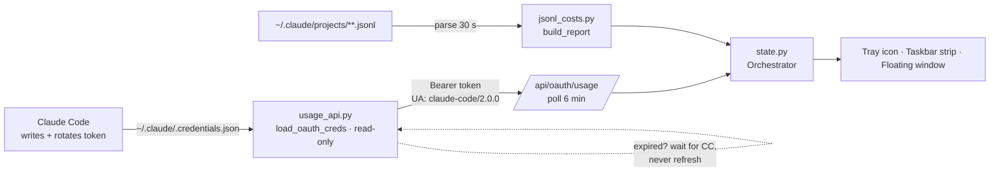

<div align="center">

# ClaudeUsageMonitor

### 一款超轻量的 Windows 托盘应用，实时显示你的 Claude Code Pro/Max 真实配额——直接复用 Claude Code 自身的登录态，让你永远无需二次登录。

**[English](README.md)** · **中文**

[](LICENSE)
[](#环境要求)
[](https://www.python.org/)
[](https://github.com/Cohenjikan/ClaudeUsageMoniter/stargazers)

**让你的 Claude 配额常驻任务栏，零额外登录。**


</div>

---

<div align="center">


*实时演示。[观看完整宣传片 →](screenshots/promo.mp4)*

</div>

---

## 为什么你会想要它

你每天大量使用 Claude Code，却总是撞上 5 小时上限或每周封顶——而且往往是*等到 Claude 提示你时才知道*。现有的监控工具要么界面像坏掉的电子表格，要么每隔几小时就逼你重新过一遍浏览器登录，要么只统计本地日志、从不显示真实的服务端配额。

**ClaudeUsageMonitor 把权威数字钉在你的任务栏上，又绝不碍事。** 它读取 Claude Code 已经写到磁盘上的同一份 OAuth 令牌，调用 Anthropic 官方的用量接口，准确告诉你离上限还有多远——在你触顶之前。

> **诀窍所在：** 它只**读取** Claude Code 位于 `~/.claude/.credentials.json` 的本地 OAuth 令牌，从不写入。本应用**没有任何登录界面**——装好即用。

---

## 你能获得什么

收益在前，机制在后。以下每一项都对应着本仓库中真实的代码。

### 零额外登录（OAuth 借用）
装好即用，直接复用你已有的 Claude Code 会话。永远无需登录任何东西。
> `usage_api.py` 读取 `~/.claude/.credentials.json`，并在**每一次**调用时都从磁盘重新读取（`load_oauth_creds`，第 89–112 行），因此能自动接住 Claude Code 自己轮换出的新令牌。整个代码库中不存在任何登录 UI。

### 真实服务端配额，而非估算
5 小时与每周百分比就是 *Claude Code 所使用的同一份权威数字*，并且涵盖你**全部**订阅用量——Code **加上** chat/desktop/web——而不是从本地日志猜出来的。
> `fetch_usage`（`usage_api.py:189`）向 `https://api.anthropic.com/api/oauth/usage` 发起 GET 请求，直接从响应中读取 `five_hour.utilization` / `seven_day.utilization`。该接口未公开文档；`User-Agent` 必须是 `claude-code/2.0.0`，否则会被归入更严格的限流桶。

### 只读鉴权——绝不会搞挂你的 Claude Code 登录
本监控器**从不刷新、从不写入**那份 OAuth 令牌。`~/.claude/.credentials.json` 里的 `refresh_token` 是和 Claude Code 共用的，而且**每次使用都会轮换**；任何进程去刷新它，都会让另一方手里的副本失效——曾经就因为在这里刷新过一次，把用户的 Claude Code 登录搞挂了。所以我们不刷。我们只读取 Claude Code 当前维护的那份 access token；一旦过期，就**等 Claude Code 自己去轮换**（它下次使用时就会刷新），随后自动拾取新令牌——这期间配额会被清楚地标记为**「数据旧」**，而不是当作实时数据展示。
> `_do_fetch_cycle`（`state.py`）全程只调用 `load_oauth_creds`（读磁盘）+ `fetch_usage`（一次 GET）。令牌过期或返回 401 时，它置位 `token_expired`，并每隔 `TOKEN_RECHECK_SEC`（45 秒，不走网络）重读磁盘，因此你下次一用 Claude Code，它几秒内就恢复。全应用没有任何一处会写 `credentials.json`。

### 始终可见的任务栏条
一条极小的无边框读数条直接停靠在 Windows 任务栏上，无需打开任何窗口即可一瞥配额。


> `TaskbarStrip`（`app.py:515+`）是一个无边框的 `overrideredirect` `Toplevel`，标称尺寸为 `STRIP_W, STRIP_H = 360, 26`，通过 `get_strip_default_y` 钉在任务栏区域内。它的宽度会在每个刷新周期自动伸缩以容纳渲染出的文字——并非固定宽度的条。

### 稳压 Win11 外壳之上
任务栏条不会被最大化窗口、任务栏或开机时的自启动竞争所遮挡。
> `app.py` 中有三道防线：每周期的置顶补偿（`_force_topmost`）、直接的 `SetWindowPos(HWND_TOPMOST)` 兜底（`_force_topmost_winapi`），以及基于 `WindowFromPoint` 的多点遮挡检测（`_is_covered`）——外加一段从 300 毫秒持续到 10 秒的启动置顶补偿连击。

### 拖拽定位，位置持久化
把它放到你喜欢的任何位置；重启后依旧停在那里。
> 移动模式下，在松开鼠标时把 x/y 坐标保存到脚本同目录、按用户区分的 `config.json`（`_on_btn1_release`）；下次启动时任务栏条会恢复到该保存位置。`reset_position` 可将其复位到默认位置。

### 按项目／今日／本月／会话的花费
看清哪些项目烧掉了最多的等效 API 费用，再配上今日／本月的累计——便于对比各项目的价值。
> `jsonl_costs.py` 解析 `~/.claude/projects/**/*.jsonl`（`iter_turns`），并聚合成 `by_project`、`by_session`、`today`、`this_month`（`build_report`）。日／月的边界以你的**本地**时区为准。

### 两档缓存定价
费用估算遵循 Anthropic 拆分的缓存创建定价，因此等效美元数字更贴近实际。
> `PRICING`（`jsonl_costs.py:21`）为每个模型分别保存 `cache_5m` 与 `cache_1h` 费率；`_parse_turn` 读取 `ephemeral_5m_input_tokens` 与 `ephemeral_1h_input_tokens`，并独立计价。

### 75 / 90 / 95% 原生阈值提醒
在你撞上上限之前，Windows 会弹出通知，措辞随着你逼近上限而逐级升级。
> `Orchestrator.THRESHOLDS = (75, 90, 95)`（`state.py:76`）；`_check_thresholds` 在每次越过阈值时触发一次，并在用量回落后重新就绪；`notify()` 发送 `winotify` 通知，其正文在 90% 与 95% 时逐级升级。

### 完整详情悬浮窗
点击任务栏条或托盘图标，即可打开一张深色卡片，内含配额进度条、重置倒计时、花费汇总以及高消耗项目列表。


> `FloatingWindow` 渲染分色的 5h/7d 进度条（在有数据时还有 Opus/Sonnet 分模型子条）、绝对重置时刻配实时倒计时（每 1 秒重绘）、会话／今日／本月花费，以及最多 6 行高消耗项目。项目面板**仅统计当月**（`by_project_month`）。默认隐藏。

### 托盘图标实时显示 5h%
即便没有打开任何窗口，系统托盘徽标也能让你一眼看到 5 小时用量，并按严重程度分色。
> `render_tray_icon`（`app.py:282`）在一个圆角矩形上绘制 5h% 整数值，颜色由 `color_for_pct` 决定（绿／橙／红），并在每次状态变化时更新。

### 双语界面与真正的设置窗口
在中英文之间切换、开关开机自启、选择状态条靠边／不透明度／显示模式——全都在同一个**托盘 → 设置**窗口里完成（常规／状态条／关于），不再是层层嵌套的托盘子菜单。
> `LANGUAGES` 保存 `en` 与 `zh` 两套字典，驱动每一处可见文案；`SettingsWindow`（`app.py`）是一个深色主题的 `Toplevel`，配有自绘的分段式标签栏。它提供语言选择器、**开机自启**复选框、状态条靠边（左／右）、不透明背景，以及四种显示模式（紧凑 / +剩余时间 / +剩余时间% / +已用时间%）。所有更改即时生效并持久化到 `config.json`。

### 秒开，且绝不会无声卡死
窗口一打开就显示你最近一次已知的配额——哪怕首次网络请求还没回来——而且全程只会运行一个实例。万一数据管线停摆（令牌过期、断网），配额会被置灰并标上**「数据旧」**及其时长，让它读起来是*旧数据*，而不是一个卡死的程序。
> 单实例命名互斥量让第二次启动安静退出（`main()`）。最近一次成功的快照会缓存到 `usage_cache.json` 并在启动时载入，再配以快速重试阶梯，网络一恢复就尽快拿到最新数字。两个重绘循环都在 `finally` 里重新排程（异常杀不掉刷新链），每一次设置面板的 PowerShell 调用都在主线程之外运行，并有一个滚动文件日志（`cc-usage-tray.log`）记录 `pythonw.exe` 否则会丢弃的诊断信息。

---

## 快速上手

**前置条件：** Windows 10/11 · Python 3.11+ · Claude Code **已登录**（即 `~/.claude/.credentials.json` 已存在）。

```powershell
# 1. 克隆
git clone https://github.com/Cohenjikan/ClaudeUsageMoniter D:\Apps\cc-usage-tray
cd D:\Apps\cc-usage-tray

# 2. 安装依赖（tkinter 随 Python 一同提供）
pip install pystray Pillow winotify

# 3. 运行——使用 pythonw（无控制台窗口）
pythonw.exe app.py
```

就这样。托盘图标会出现并显示实时的 5h%，任务栏条也会钉到你的任务栏上。**没有登录提示——它复用你已有的 Claude Code 会话。**

### 可选：开机自启动

最简单的方式：打开**托盘 → 设置 → 常规**，勾选**开机自启**。它会帮你创建（并删除）启动文件夹中的快捷方式，并使用 `pythonw.exe` 以避免开机时弹出控制台窗口。如果本应用的自启动启动器已存在，该复选框会自动识别并反映其状态。

手动方式（备选）——在启动文件夹（`Win+R` → `shell:startup`）中创建一个快捷方式，指向：

```
目标：      "<python_install>\pythonw.exe" "D:\Apps\cc-usage-tray\app.py"
起始位置：  D:\Apps\cc-usage-tray
```

请使用 `pythonw.exe`（而非 `python.exe`），以避免开机时一闪而过的控制台窗口。

---

## 认证机制如何运作

有意思（且未公开文档）的部分在于：Anthropic 暴露了 `https://api.anthropic.com/api/oauth/usage` 接口，它返回的正是 Claude Code 自身所用的同一份权威 5h / 每周用量。我们借用 Claude Code 位于 `~/.claude/.credentials.json` 的本地 OAuth 令牌（无需单独登录），并以如下方式调用该接口：

```http
Authorization: Bearer <accessToken from credentials>
anthropic-beta: oauth-2025-04-20
User-Agent: claude-code/2.0.0     # 必需——缺少它将被打入严格的限流桶
```

响应（结构示意——数值仅供示例）：

```json
{
  "five_hour": {"utilization": 33.0, "resets_at": "2026-05-26T00:50:00+00:00"},
  "seven_day": {"utilization": 91.0, "resets_at": "2026-05-26T00:59:59+00:00"}
}
```

该接口的限流约为每令牌 5 次请求，因此我们每 **6 分钟**轮询一次。本地 JSONL 花费视图刷新更快，每 **30 秒**一次。



---

## 为什么要做这个项目

现成的方案各有一处让人无法接受的硬伤。（*本*项目的认证／UI 机制均依据此处的代码验证；对其它工具的评价为作者一家之言。）

| 工具 | 认证方式 | 界面 | 致命伤（作者观点） |
|---|---|---|---|
| [CodeZeno/Claude-Code-Usage-Monitor](https://github.com/CodeZeno/Claude-Code-Usage-Monitor) | 借用 Claude Code OAuth | 像素化的彩色方块 | 界面丑 |
| [SlavomirDurej/claude-usage-widget](https://github.com/SlavomirDurej/claude-usage-widget) | Claude.ai 网页会话 | Electron 小部件 | 周期性的浏览器重新登录 |
| [ryoppippi/ccusage](https://github.com/ryoppippi/ccusage) | 仅本地 JSONL | CLI / statusline | 无 GUI · 无真实服务端配额 |
| **ClaudeUsageMonitor** | **OAuth 借用** | **托盘 + 任务栏条 + 窗口** | **仅限 Windows** |

本项目从这三者中各取所长：**OAuth 借用式认证**（零重新登录）+ **干净的 tkinter 界面** + **真实的服务端配额 %** + 来自本地 JSONL 的**按项目花费**。它嵌在 Win11 任务栏区域内，配以三重置顶防御，使最大化窗口在结构上无法将其遮挡——这正是大多数悬浮小部件忽视的问题。

---

## 诚实的注意事项（可信本身就是一项特性）

在你依赖这些数字之前，请先读完它们。它们是有意为之，而非缺陷。

- **`$` 金额仅涵盖 Claude Code（CLI）。** 今日／会话／本月／按项目的美元数**纯粹**来自本地 `~/.claude/projects` 的会话记录。Claude **桌面应用与网页 chat 不会写入任何本地 token 计数**，因此在只用 chat 的日子里，**「今日 $」会停留在 $0.00**。 5h/7d 的**百分比**进度条则不同——它们来自服务端，**确实**把 chat 与 code 一并计入。如果你两者混用，这才是该盯紧的数字。
- **等效 API $ 仅供对比，不用于计费。** 你支付的是固定的 Pro/Max 订阅费。这些美元估算的是同样的 token 在按量付费 API 上会花多少钱——用于给项目价值排序很有用，但不对应你的账单。
- **服务端配额最多每 6 分钟更新一次。** `/api/oauth/usage` 接口限流相当严格（约每令牌 5 次请求），因此百分比可能比实时用量滞后几分钟。本地 JSONL 花费每 30 秒刷新一次。
- **任务栏条默认显示在主显示器上。** 拖动后的位置可能落到副显示器上；**重置任务栏条位置**会让它回到主显示器。
- **独占全屏的游戏／应用会渲染在用户空间一切之上**，因此当某个这样的程序在前台时任务栏条会被遮住。请改用无边框窗口模式以保持其可见。
- **仅限 Windows 10/11。** 尽管凭据路径在 macOS/Linux 上同样存在，整套 UI 都是 Windows 专属的（ctypes/user32、任务栏钉附、`winotify` 通知，以及一处用于通知投递的 PowerShell 路径修复）。它**不是**跨平台的。
- **需要已有的 Claude Code 登录。** 本应用自身没有任何登录功能；它依赖 `~/.claude/.credentials.json` 事先就在那里。
- **令牌过期时，配额只会「变旧」，绝不会变错。** 因为本应用从不刷新那份共用令牌（刷新可能搞挂你的 Claude Code 登录），access token 只在 **Claude Code 自己使用时**才续期。如果你 ~8 小时没碰 Claude Code（比如过夜），令牌就会过期、配额随之冻结——但它会被清楚地**置灰并标上「数据旧」及其时长**，你下次一用 Claude Code，约 45 秒内就恢复实时。数据旧 ≠ 程序卡死。
- **它依赖一个未公开文档的接口和一个伪造的 User-Agent。** 这并非 Anthropic 官方或受支持的集成——Anthropic 随时可能更改 `/api/oauth/usage` 接口或对 `claude-code/2.0.0` UA 的预期，从而让配额读数失效。

---

## 架构

```
usage_api.py     OAuth 令牌加载器（只读）+ /api/oauth/usage HTTP 客户端。
jsonl_costs.py   JSONL 解析器 + 花费聚合器（内联的两档缓存定价表）。
state.py         两个守护线程：API 轮询（6 分钟）与 JSONL 解析（30 秒）。
                 只读鉴权：从不刷新共用令牌，过期时把数据标记为旧；
                 阈值越线告警每个窗口每次越线触发一次。
app.py           入口点：tkinter FloatingWindow + pystray 托盘图标 + TaskbarStrip。
                 任务栏条采用三重置顶防御，稳压 Win11 外壳之上。
```

---

## 配置

大多数行为是 `app.py` 顶部的常量：

```python
WINDOW_W, WINDOW_H = 340, 460     # 悬浮窗口尺寸
STRIP_W, STRIP_H = 360, 26        # 任务栏条标称尺寸（宽度会自动伸缩以容纳文字）
STRIP_SIDE = "left"               # "left" 或 "right"——靠哪一侧屏幕边缘
STRIP_SIDE_MARGIN = 12            # 与所选边缘的间距
STRIP_GAP_FROM_TASKBAR = 0        # 任务栏条底部与任务栏顶部之间的间距
```

按用户区分的状态（状态条位置、靠边、显示模式、不透明背景开关，以及语言）保存在脚本同目录的 `config.json` 中——通过拖动以及**托盘 → 设置**来设置。该文件按用户区分且被 git 忽略，因此全新克隆出来时并不存在，直到你创建它；删除它，或使用**重置位置**（设置 → 状态条），即可复位到默认值。

定价表位于 `jsonl_costs.py:PRICING`——当 Anthropic 调整费率或推出新的模型系列时，请更新它。

---

## 环境要求

| | |
|---|---|
| **操作系统** | Windows 10 或 11 |
| **Python** | 3.11+ |
| **依赖** | `pystray`、`Pillow`、`winotify`（tkinter 随 Python 一同提供） |
| **前置条件** | 已安装并登录 Claude Code（`~/.claude/.credentials.json` 必须存在） |

---

## 许可证

[MIT](LICENSE) © 2026 Cohenjikan.

这是一个非官方的、社区构建的工具。它与 Anthropic 无任何关联，亦未获其背书或支持。「Claude」与「Claude Code」是 Anthropic 的商标。`/api/oauth/usage` 接口未公开文档；请自行斟酌使用。

---

<div align="center">

**如果它让你免于哪怕一次限流惊吓，欢迎点个 Star。**

[反馈问题](https://github.com/Cohenjikan/ClaudeUsageMoniter/issues) · [仓库](https://github.com/Cohenjikan/ClaudeUsageMoniter)

</div>
